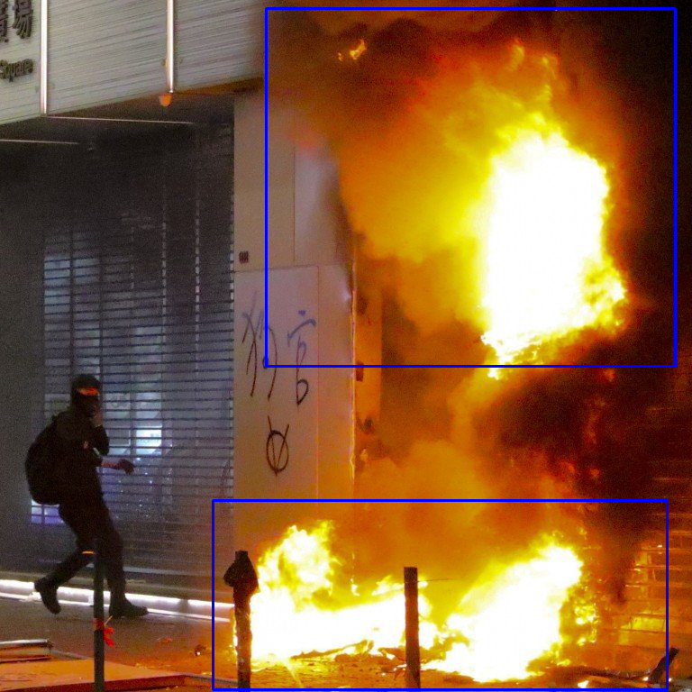

# REGION SELECTION AND MASKING

This jupyter-notebook script was written to annotating disaster images. The purpose was to compare the model annotation vs human annotation.

## Library
1. OpenCV
2. PIL
3. Numpy

### Installation
`$ pip install opencv-python pillow numpy`

## Input
1. Directory of Images

### Directory Structure

data\
    ├── class_1\
    │   ├── image_1\
    │   ├── image_2\
    │   └── iamge_3\
    ├── class_2\
    │   ├── image_1\
    │   ├── image_2\
    ├── class_3\
    │   ├── image_1\
    │   └── image_2\
    │   └── image_3\
    └── class_n\

## Method

### Running the script (Linux)
1. First activate your anaconda environment
2. Then run on terminal
```bash
$ jupyter-notebook
```

###  Process of selection
1. Select a ROI and then press SPACE or ENTER button!
2. Cancel the selection process by pressing c button!


## Output Directory
1. Border_Images
2. Output with same structure as data directory

## Output Screenshot

<table>
  <tr>
    <td>Figure-1: Bordered Image</td>
    <td>Figure-2: Masked Image</td>
  </tr>
  <tr>
    <td></td>
    <td></td>
  </tr>
 </table>